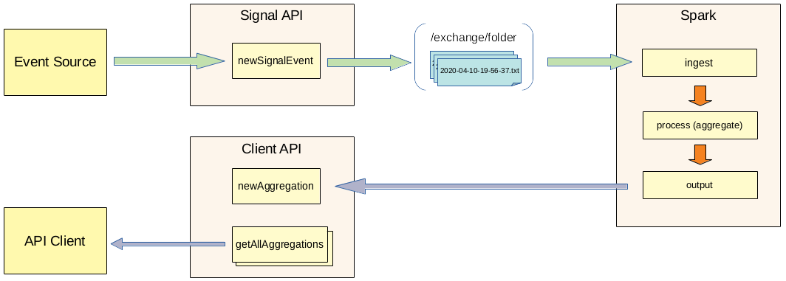

# nishi-seto
Signal processing API and jobs  
Similar (but simplified version) is written in Java: [shimanami-kaido](https://github.com/oleglukin/shimanami-kaido)


## Business Case
Suppose that there are certain signals or events that come from some source system. The task is to do some aggregation on the fly and keep current results available for users to view.  
Signal schema:

```
{
  "source": "CPST_GL9951FT", 	// signal source identifier
  "attribute": "Engine Speed", 	// attribute name, e.g. temperature, pressure
  "uom": "rpm", 		// unit of measure
  "value": "927",		// valid value (e.g. a number) or an invalid one like 'read failure'
  "timestamp": "2020-04-26T21:47:02.614Z" // date/time
}
```
The basic requirement is to find current number of both functional and failed signals per `source`.

## Components
There are 4 components (applications) in this repository:
1. [sparkclient](https://github.com/oleglukin/nishi-seto/tree/master/sparkclient)
2. [siganl-api](https://github.com/oleglukin/nishi-seto/tree/master/signal-api)
3. [client-api](https://github.com/oleglukin/nishi-seto/tree/master/client-api)
4. [eventsource](https://github.com/oleglukin/nishi-seto/tree/master/eventsource)





### 1. Sparkclient
This application contains Spark driver program and events stream processing logic (aggregation).

It ingests data from a local folder (configurable within the properties file). The folder is monitored for new files and the new files are ingested as a stream.

This data should have a schema matching signal event to be parsed (see data model above).

It defines if value is a valid number (otherwise failed) and then groupes by `source` to find total number (count) of functional and failed events for each source.  
Once grouped the data is being sent to an HTTP endpoint (see API methods below).

### 2. Signal API
Process incoming signals and output them for Spark jobs to process.  
There is one method so far:

```
POST    /api/signal                 controllers.SignalController.newSignalEvent
```

There is a class called `SignalHandler`. It's purpose is to accumulate new signals from controller and dump them to a text file once in a while.

### 3. Client API
Make processing results available for clients.  
Methods:  
`GET     /api/source/list` - returns list of sources that have some aggregations available  
`GET     /api/source/agg-:source` - get aggregation results by source  
`GET     /api/source/all` - get aggregations for all locations  
`GET     /api/source/totalevents` - get total number of events processed  
`POST    /api/source/agg-:source/:valid/:count` - accept new aggregation, add/update in memory to make it available for API clients  
`DELETE  /api/source/agg-:source` - remove aggregation for a given source  
`DELETE  /api/source/all` - remove all aggregations

### 4. EventSource
This is only for testing. Create a number of random events and send them to APIs HTTP endpoint.


## Things to Improve / Consider Changing
- Ingest evens through TCP socket connection or use Kafka. Currently it reads events from  files in a folder
- Probably would be better to output aggregation results to Kafka or other queue as well
- Test and make sure that sparkclient can work with Spark cluster (standalone or YARN/Mesos)

